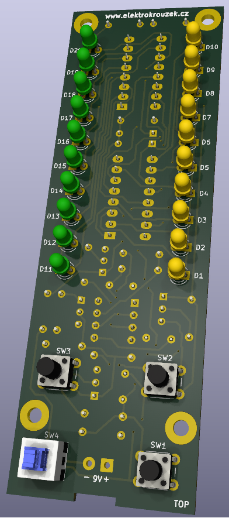
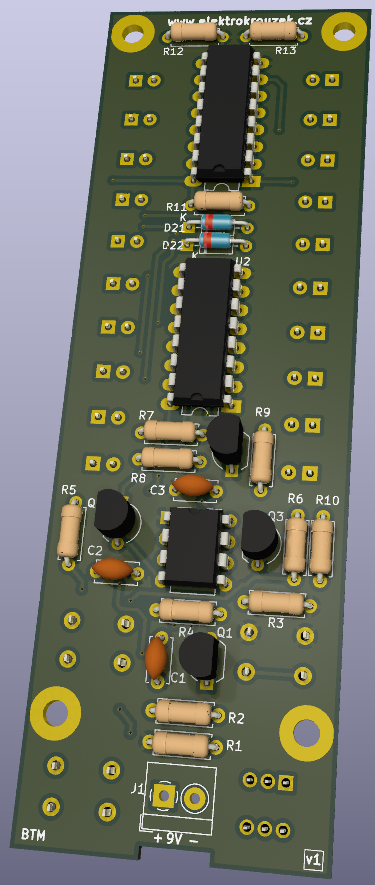

# Lightning distance meter
This is the construction of lightning distance meter. It is based on NE555 timer 
and 4017 logical circuits. All components are in THT packages.

PCB is 2-layer and was designed using KiCad 8. Fabrication output for JLCPCB is in 
gerber folder.

## How it works
This meter measures distance between lightning and thunder by measuring the time.
Speed of sound is 343 m/s therefore it takes approx. 291ms to the sound to travel
100m (this is the period of NE555 timer). 
User pushes Start button when lightning occurs and then presses Stop button when 
hears the thunder. LED diodes shows measured distance. Maximal measurable distance is 9.9km. 

**Happy soldering!**

